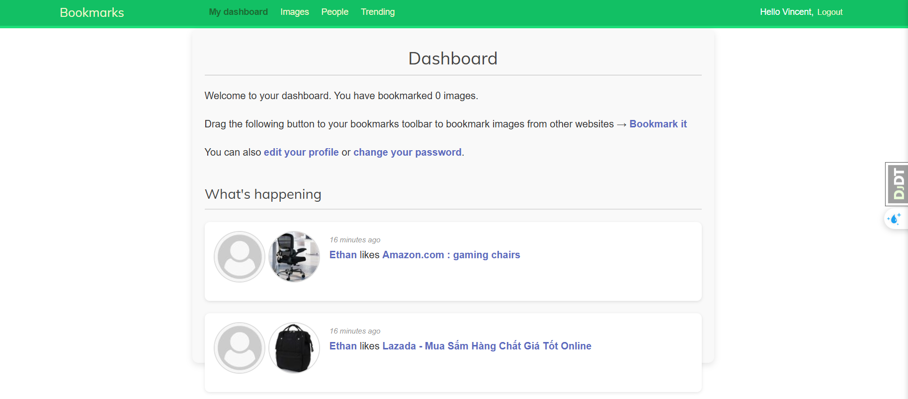
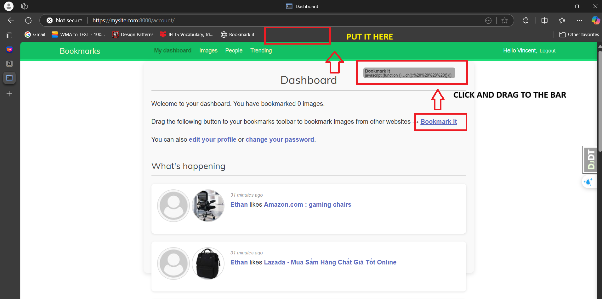
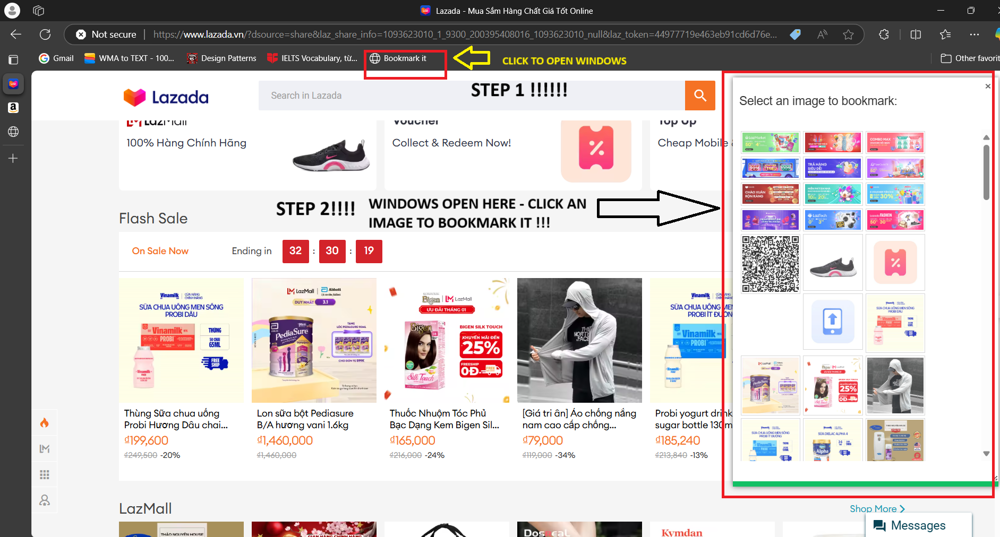
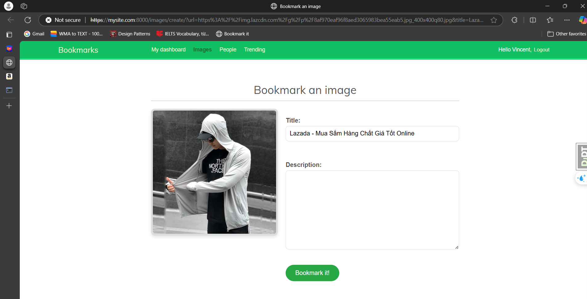
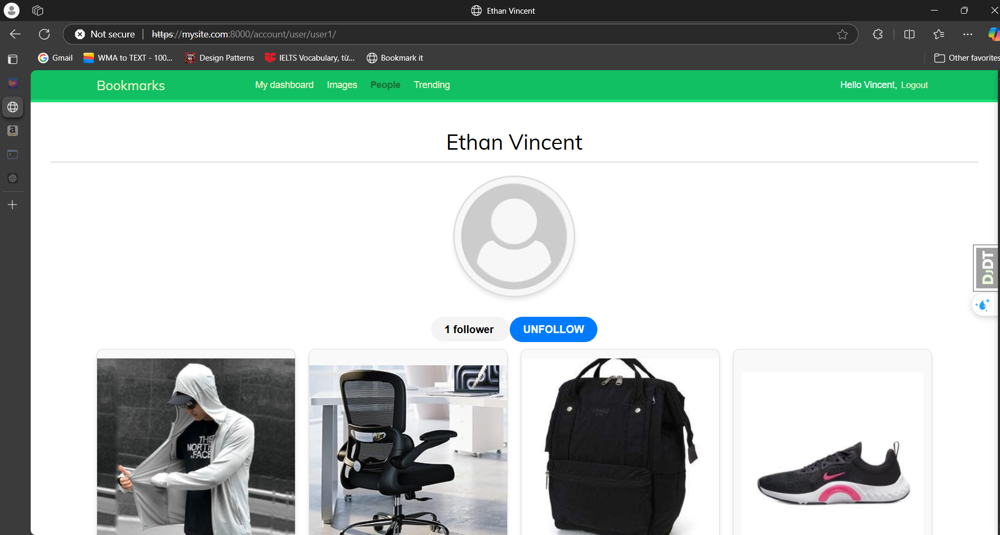
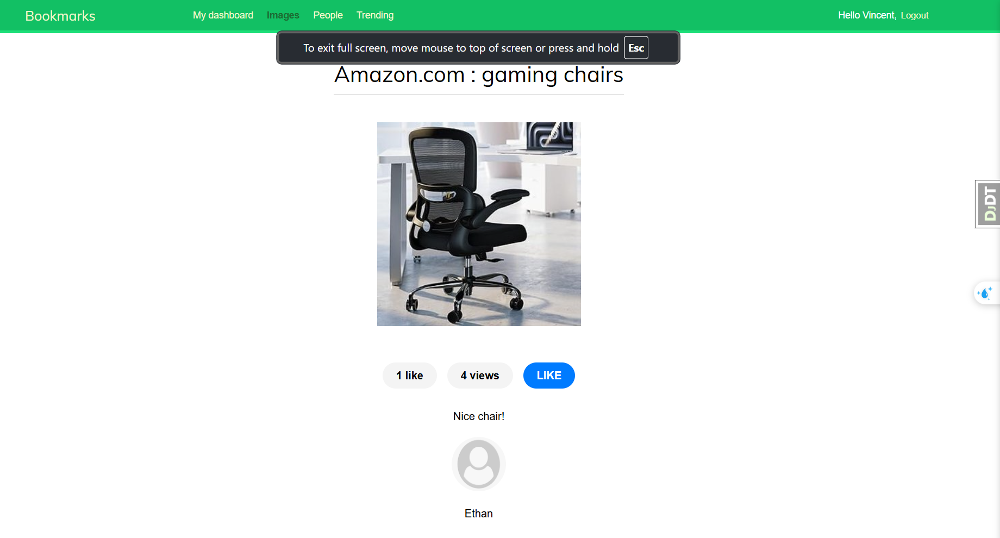

# Bookmarks Project

This is a Django-based web application for bookmarking images, managing user profiles, and enabling social interactions like following users and liking images.

# Video demo here

[](demo/app-demo-vid.mp4)

## Technologies Used

- **Backend**: Django 4.2, Python 3.11, Redis
- **Frontend**: HTML5, CSS3, JavaScript
- **Database**: PostgreSQL (production), SQLite (development), Redis
- **Authentication**: Django Auth, Social Auth (Google OAuth2)
- **Tools**: Git, Pipenv

## Features

- **User Management**

  - Registration, login, and profile management
  - Custom email authentication
  - Password reset functionality
  - Profile customization with avatars and bios

- **Image Bookmarking**

  - Bookmark images from URLs
  - Add metadata (title, description)
  - Like and track image views
  - Image ranking system using Redis

- **Social Features**
  - Follow other users
  - Activity dashboard
  - Social authentication via Google
  - Admin interface for content management

# Main feature

- CREATE A SHORTCUT
  
- BOOKMARK AN IMAGE ON OTHERS WEBSITE
  
- WRITE DESCRIPTION AND SAVE IT
  
- FOLLOW
  
- LIKE
  

## Installation

1. Clone the repository:

   ```bash
   git clone https://github.com/yourusername/bookmarks.git
   cd bookmarks
   ```

2. Set up pipenv environment:

   ```bash
   pip install pipenv
   pipenv install
   pipenv shell
   ```

3. Install dependencies:

   ```bash
   pip install -r requirements.txt
   ```

4. Set up environment variables:

   - Create a `.env` file in the project root
   - Add required variables:
     ```
     SECRET_KEY=your_secret_key
     DEBUG=True
     ALLOWED_HOSTS=localhost,127.0.0.1
     GOOGLE_OAUTH2_KEY=""
     GOOGLE_OAUTH2_SECRET=""
     ```

5. Initialize database:

   ```bash
   python manage.py migrate
   ```

6. Start Redis server:

   ```bash
   redis-server
   ```

7. Run development server:
   ```bash
   python manage.py runserver
   ```

Access the application at `http://localhost:8000`
